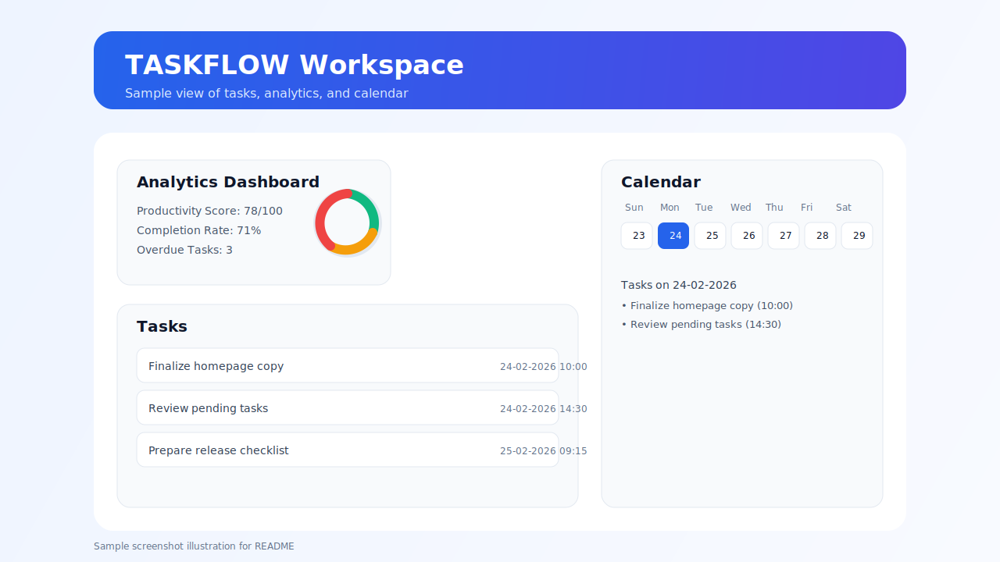

# TASKFLOW

<p align="center">
	<b>Your daily task planner with routines, calendar + analytics.</b><br/>
	Stay organized, build habits, track progress, and finish work on time.
</p>

---

## 📸 Workspace Preview



---

## ✨ What is TASKFLOW?

TASKFLOW is a modern productivity app for people who want a simple way to plan tasks, build habits, and see progress.

You can:
- Add tasks with due date, time, and priority
- Create weekly routines (daily or specific days)
- View everything in task list + calendar format
- Track productivity with built-in analytics + routine adherence
- Use Guest mode instantly or Account mode for sync

---

## ✅ Key Features

- **Clean Workspace UI** (easy to use on desktop + mobile)
- **Task Priorities** (LOW / MEDIUM / HIGH)
- **Weekly Routines** (create recurring habits for daily or specific days)
- **Routine Adherence Tracking** (monitor weekly & monthly habit consistency)
- **Calendar View** (see tasks + routines by day)
- **Analytics Dashboard** (score, completion, overdue, distribution)
- **Dark / Light Mode**
- **Guest Mode** (no login required, routines saved locally)
- **Offline Support** (with auto sync when internet returns)

---

## 📴 Offline Support

TASKFLOW works as an installable app and supports offline usage:

- **Homepage + Guest Mode:** available offline (local storage)
- **Account Mode (after previous login):** opens offline with cached tasks
- **Offline edits in Account Mode:** changes are saved locally in a queue
- **When internet returns:** queued changes sync automatically with your account
- **App updates:** new app version is fetched in the background and applied on next open/refresh

---

## 🧩 Tech Stack

<p>
	
	
	
	
	
	
</p>

- Next.js + TypeScript for app experience
- Tailwind CSS for clean, responsive UI
- Prisma + PostgreSQL (Neon) for data
- NextAuth for secure account login

---

## 🚀 Quick Start

### 1) Install

```bash
npm install
```

### 2) Create your env file

```bash
copy .env.example .env
```

### 3) Run

```bash
npm run dev
```

### 4) Open app

http://localhost:3000

---

## 👤 For non-technical users

- Use **Guest Mode** to try the app immediately (tasks + routines saved in browser)
- Use **Account Mode** if you want saved/synced tasks across devices
- **Routines** help you build consistent daily or weekly habits
- Analytics helps you quickly understand your productivity each day

---

## 🛠 Basic Notes

- Account mode needs database values in `.env`
- Notification behavior can vary by device/browser settings

---

## 🔒 Security Note

- User passwords are **not stored in plain text**.
- Passwords are hashed using **bcrypt** before saving.
- During login, TASKFLOW verifies passwords securely against the hashed value.

---

## 📝 License & Contribution

TASKFLOW is licensed under **AGPL 3.0** — open source with community in mind.

### What This Means

You can:
- ✅ **Use & Deploy** — Run TASKFLOW for your business or personal use
- ✅ **Study & Learn** — Explore the code to understand how it works
- ✅ **Modify & Improve** — Fork it and make changes
- ✅ **Contribute** — Submit pull requests with improvements
- ✅ **Commercialize** — Build a service or product using TASKFLOW

The only requirement:
- If you provide TASKFLOW as a service (SaaS/hosted), any modifications must be open-sourced under AGPL 3.0
- You must keep attribution to ShadowXByte visible

### Contributing

We love contributions! Whether it's:
- 🐛 Bug fixes
- ✨ New features
- 📚 Documentation improvements
- 🎨 UI/UX enhancements

**Your code, ideas, and feedback matter.** All contributions benefit the entire community.

Thank you for helping make TASKFLOW better! ❤️

**License:** [GNU AGPL 3.0](https://www.gnu.org/licenses/agpl-3.0.html)

---

## ❤️ Built by

**ShadowXByte**
